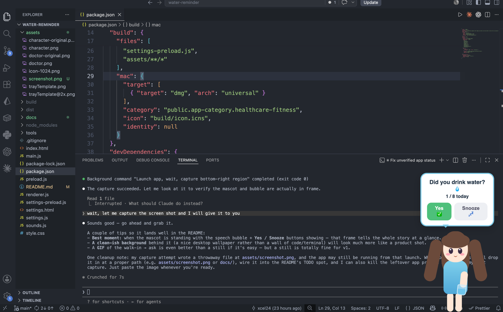

# ⏰ Nudge — a desktop companion for your daily habits

Nudge is a menu-bar app where a little character walks across your screen, does a
gesture, and asks whether you've done a daily habit — **Yes** or **Snooze**. Add as
many reminders as you like (water, vitamins, stretching…), each with its own goal,
interval, prompt, and **mascot**.



---

## ⬇️ Download & install

Get it on **[itch.io](https://xcel24.itch.io/nudge-a-desktop-buddy-for-your-daily-habits)**, or grab the latest build from the [**Releases page**](../../releases).

Nudge is a **macOS** app and is **not code-signed** (that requires a paid Apple
Developer account), so macOS will show a one-time "unverified developer" warning.
This is expected for indie apps — here's how to get past it. You only do this **once**.

1. Open the `.dmg` and drag **Nudge** into your **Applications** folder.
2. **Right-click** Nudge in Applications → **Open** → click **Open** in the dialog.
   *(Right-clicking is the trick — double-clicking won't give you the "Open" button.)*
3. Look for the 💧 icon in the **top-right menu bar** — that's Nudge running.

If macOS says the app is *"damaged and can't be opened,"* clear the download flag
once from Terminal:

```bash
xattr -cr "/Applications/Nudge.app"
```

> Why the warning? Signing certificates cost money and Nudge is free. The app is
> open source — you can read every line in this repo.

---

## 🐣 What it does

- A mascot **walks in, gestures, and asks** if you've done a habit. Answer **Yes**
  (counts it) or **Snooze** (asks again in 15 min).
- **Multiple reminders**, each with its own **mascot**, goal, interval, and prompt.
- Each reminder tracks its own **daily count + streak** and goes quiet once its goal
  is met — until the next day.
- Lives in the **menu bar**. No Dock icon, no window clutter.
- Ships with three reminders out of the box: **Water** (water girl), **Multivitamin**
  (doctor), and **Exercise** (gym trainer).

## ⚙️ Reminders & settings

Menu-bar icon → **Settings…** opens the reminder manager. For each reminder:

- **Emoji + Name** — e.g. 💊 Multivitamin
- **Goal** — times per day (a vitamin is just `1`)
- **Every** — minutes between nudges
- **Mascot** — 💧 Water girl, 🩺 Doctor, 🏋️ Gym trainer, or 🙂 Buddy (default)
- **Prompt** — what the mascot asks

Add / delete reminders, toggle **Sound effects**, and hit **Save** — changes apply
live, no restart.

---

## 🛠️ Run from source

```bash
npm install
npm start
```

The first reminder greets you ~1.5s after launch.

### Build a distributable

```bash
npm run package   # macOS → dist/Nudge.dmg (universal: Apple Silicon + Intel)
npm run dist      # electron-builder --mac
```

The build is intentionally unsigned (`identity: null` in `package.json`). See the
install steps above for how recipients open it.

## 📁 Project layout

| File | Role |
|------|------|
| `main.js` | Electron main — overlay window, tray, per-reminder timers, persistence |
| `preload.js` / `settings-preload.js` | Secure IPC bridges |
| `index.html` / `style.css` | Character (mascots) + speech bubble |
| `renderer.js` | Walk-in / gesture / ask flow + reminder queue |
| `sounds.js` | Synthesized sound effects (Web Audio, no files) |
| `settings.html` / `settings.js` | Reminder manager UI |
| `tools/` | Icon generators + `package-mac.sh` build script |

## 🎨 Adding a new mascot

Mascots can be **CSS-drawn** (like `water-girl`/`trainer`, whose limbs animate) or a
**transparent image** (like `doctor`, animated as a whole body).

1. Add a `.mascot` block in `index.html`:
   - CSS mascot: reuse part classes `head`/`arm`/`leg` so the shared pose animations
     apply, and scope its styles in `style.css` (see `.trainer`).
   - Image mascot: ``, after cutting out the
     background (`node tools/remove-bg.js in.png assets/NAME.png` then
     `node tools/trim.js assets/NAME.png`).
2. Add its id to `MASCOTS` in `main.js`; add a label in `settings.js`.

## 📄 License

MIT — do what you like, no warranty.
